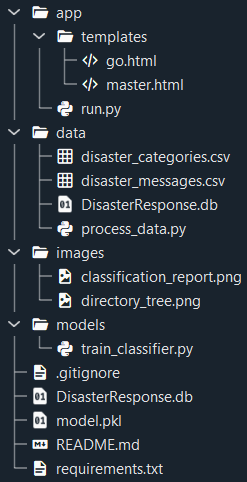
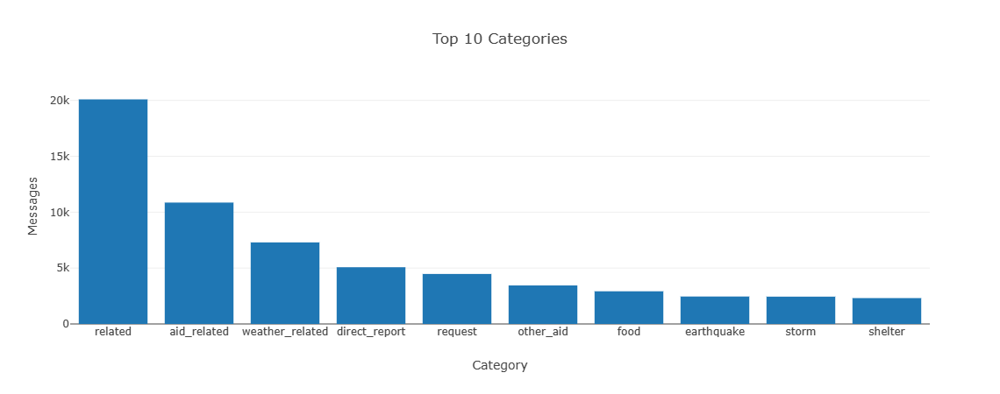

# Disaster Response Pipeline
The Disaster Response Pipeline classifies messages from various sources during an emergency.
Rather than searching through potentially important key words, a model has been trained to categorize
each message.

The project used the following layout:
1. ETL Pipeline
2. ML Pipeline
3. Flask Web App


## Table of Contents
- [Libraries Used](#libraries-used)
- [Project Motivation](#project-motivation)
- [Directory Tree](#directory-before)
- [File Descriptions](#file-descriptions)
- [Running the Model](#running-the-model)
- [Results](#results)
- [Flask Web App](#flask-web-app)
- [Future Considerations](#future-considerations)


## Libraries Used
Also listed in the **requirements.txt** file, the following packages are required:
- Flask
- joblib
- nltk
- numpy
- pandas
- plotly
- scikit_learn
- SQLAlchemy

Note that this is basic listing, and sub-packages such classifiers from scikit-learn and
corpuses from nltk libraries are used throughout the pipeline.

[Table of Contents](#table-of-contents)


## Project Motivation
In the midst of an emergency, such as a natural disaster, thousands of messages are
being sent. It's important to be able to categorize these messages to optimize efforts and resources.

By utilizing natural language processing in a pipeline, a model was built to do just this.

[Table of Contents](#table-of-contents)


## Directory Tree
Before exploring each file, here's a visual on how they're ultimately structured:



[Table of Contents](#table-of-contents)


## File Descriptions
First off, it should be noted that the following files are strictly for creation of this README:
- README.md
- images/...

Additionally, the visual of the tree contains the file **model.pkl**. This file was omitted in
the GitHub upload due to size issues. This is how the **.gitignore** file was used.

Pertinent files (besides **model.pkl**) for building and running the pipeline:
- go.html
- master.html
- run.py
- disaster_categories.csv
- process_data.py
- train_classifier.py

Files created during the ETL and ML process:
- DisasterResponse.db
- model.pkl

**requirement.txt** isn't necessarily required, but serves as an additional resource.

The **HTML** files are used after the model is created, so we'll focus on an explanation for
ETL and ML python files first.

1. ETL Pipeline (**process_data.py**): loads csv files, cleans the data, and then saves
the cleaned data into a SQLite database.

The python file contains the following functions:
- **load_data**: takes in 2 csv files, merges them, and returns a DataFrame.
- **clean_data**: takes in the merged DataFrame, uses various methods to clean the data,
and returns a DataFrame of cleaned data.
- **save_data**: takes the cleaned DataFrame and a name for the database, and saves as a
SQLite database.
- **main**: puts together the above functions into a single process.

2. ML Pipeline (**train_classifier.py**): loads the SQLite database, performs various machine
learning and natural language processing techiques to train a model, which is then saved as 
a pickle file.

The python file contains the following functions:
- **load_data**: takes in the file pathway to the SQLite database and returns three components needed
for training and evaluation: dependent variable, independent variables, and names of the categories.
- **tokenize**: this takes in a message, applies tokenization, lemmatization and removes puncuation via
a regex function, ultimately returning the message in a clean token format.
- **build_model**: this uses Pipeline and GridSearchCV to create an object the model will be 
trained and optimized on. Note there is a secondary build_model commented out that has less
complexity for testing purposes (less complexity means shorter run time).
- **evaluate_model**: takes in the trained model, the dependent and independent variables from the
testing set split, and the category names. Returned is a classification report which displays
key metrics (precision, recall, f1-score) for how well the model performed.
- **save_model**: takes in the model and a file path of where to save the model, and will save
the model as pickle file (.pkl).
- **main**: puts together the above functions into a single process.

[Table of Contents](#table-of-contents)


## Running the Model
Assuming the aforementioned file structure was followed and the python scripts are complete,
running the model requires a few command lines into a terminal.

1. ETL:
```
python data/process_data.py data/disaster_messages.csv data/disaster_categories.csv data/DisasterResponse.db
```

2. ML:
```
python models/train_classifier.py data/DisasterResponse.db models/classifier.pkl
```

3. Flask:
```
cd app
python run.py
```

This will result in a local Flask application being produced in a web browser.

[Table of Contents](#table-of-contents)


## Results
The Flask app was functional, however maybe the build of the model could've been 
experimented with more.

Here are the metrics of model perfomance:


[Table of Contents](#table-of-contents)


## Flask Web App
Included in this application are three relevant statistical images:
1. Distribution of Message Genres


2. Top 10 Categories


3. Categories per Message


Additionally, given a potential message, here's an illustration of categories being
selected:


[Table of Contents](#table-of-contents)


## Future Considerations
- Due to time constraints and hardware limitations, a more complex model wasn't
tested or constructed. In the future it would be great to expand the parameter list
while using GridSearchCV and try several different classifiers. XGBoost would be an ideal
candidate.
- Research for GridSearchCV also provided alternatives for GridSeachCV, itself.
Among the list were RandomizedSearchCV and BayesSearch.
- It should be mentioned that a significant portion of messages actually weren't sorted
into any of the 36 categories. This may initially feel like an error to train a model using these
type of data points, however they are actually significant in the fact they are irrelevant. If 
a model is trained on only relevant messages, it will place a false priority on a irrelevant messages.
- Web server deployment.


Ultimately, this project will benefit the community. In the event of a future disaster,
millions of communications will be sent out, and response organizations will be at their 
full capacity. A model like this will help guide these organizations where to best use their resources. 

Take a look at the **Categories per Message** image above. Messages which were not relevant to needing an
emergency response (i.e. triggered zero of the categories) were the most prevalent. This is just from a 
few thousand messages. Scale the data into the millions, such as providing emergency responses to an entire
major city, and a model like this will truly save lives.

[Table of Contents](#table-of-contents)